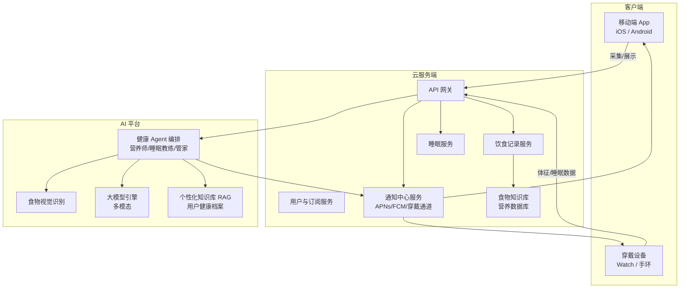
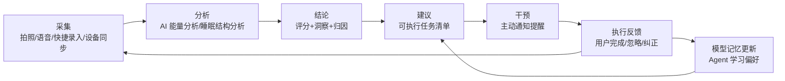

# 软件需求规格说明书（SRS）

## 「AI 健康伴侣」— 饮食与睡眠健康能量分析系统

| 项目 | 内容 |
|------|------|
| 文档编号 | SRS-AIH-2026-001 |
| 版本 | V1.1 |
| 编写日期 | 2026-08-03 |
| 修订说明 | V1.1：合并《健康伴侣-功能清单 V1.2》（七大要素诊断、全天候节律陪伴、起居注等）；手环/手表绑定与穿戴通知调整为后期开发 |
| 文档状态 | 评审稿 |
| 编写依据 | GB/T 8567 / IEEE 830 软件需求规格说明 |

---

## 目录

1. [引言](#1-引言)
2. [总体描述](#2-总体描述)
3. [系统架构与闭环机制](#3-系统架构与闭环机制)
4. [功能需求](#4-功能需求)
5. [AI Agent 需求](#5-ai-agent-需求)
6. [通知系统需求](#6-通知系统需求)
7. [数据需求](#7-数据需求)
8. [接口需求](#8-接口需求)
9. [非功能需求](#9-非功能需求)
10. [验收标准](#10-验收标准)
11. [原型说明](#11-原型说明)
12. [附录](#12-附录)

---

## 1. 引言

### 1.1 编写目的

本文档定义「AI 健康伴侣」（下称"本系统"）的功能、性能与交付要求，作为产品设计、技术开发、测试验收及项目管理的统一依据。

### 1.2 产品背景与定位

本系统是一款面向个人用户的 **AI+健康管理应用**，聚焦两大核心场景：**饮食健康** 与 **睡眠健康**。产品理念为 **"零焦虑、重陪伴"**：帮助高压工作人群重新学会感知身体信号，通过智能设备与 AI Agent 建立 **"无感采集 → 智能评估 → 最小可执行微行为 → 形成正循环"** 的健康生活习惯。核心差异化在于：

- **主打饮食健康能量分析**：不满足于"记录卡路里并展示图表"，而是由 AI 对每一餐的能量结构、营养素配比、进食时序进行深度分析，给出个性化结论与行动建议；同时以"七大要素"质感饮食诊断（优质蛋白/优质碳水/膳食纤维/脂肪质量/水分/维生素矿物质）替代精算卡路里的焦虑感。
- **Agent 驱动、功能闭环**：系统内置 AI Agent（营养师 Agent / 睡眠教练 Agent / 健康管家 Agent），从数据采集 → 分析 → 建议 → 干预 → 反馈 形成闭环，而不是孤立的"数据展示工具"；干预动作按全天生理节律触发（晨间唤醒/餐前/久坐/午后低谷/睡前）。
- **全场景通知触达**：支持手机推送通知、锁屏通知（Rich Notification 与快捷动作），预留智能手表/手环通知通道（**后期开发**）。

### 1.3 目标用户

| 用户类型 | 特征 | 核心诉求 |
|----------|------|----------|
| 普通用户（C 端） | 关注体重管理、饮食质量的上班族/健身人群 | 记录方便、看得懂、提醒及时 |
| 深度用户 | 长期减肥/增肌/控糖人群 | 个性化能量目标、闭环干预 |
| 健康关注者 | 睡眠不佳、作息紊乱人群 | 睡眠评分、睡前干预 |
| 潜在付费用户 | 对深度 AI 分析、报告、高级教练有需求 | 付费订阅高级功能 |

### 1.4 术语与缩写

| 术语 | 说明 |
|------|------|
| 能量（Energy） | 食物总热量与营养素（碳水/蛋白/脂肪/膳食纤维）的综合能量画像 |
| 能量缺口 | 当日摄入热量与目标热量的差值 |
| Agent | 具备规划、工具调用、记忆能力的 AI 智能体 |
| 闭环（Loop） | 采集→分析→建议→干预→反馈→再采集 的完整循环 |
| 锁屏通知 | 手机锁屏界面直接展示的丰富通知（Rich Notification） |
| 手环/手表 | 可穿戴设备（Wearable Device）（后期开发接入） |
| PUSH | 服务端推送通知通道（APNs / FCM） |
| 七大要素 | 优质蛋白、优质碳水、膳食纤维、脂肪质量、水分、维生素与矿物质（含早餐三要素专项）的质感饮食诊断框架 |
| 身体电量 | 基于睡眠/HRV/疲劳度综合评估的当日精力值（0-100%） |
| 防亏空保护 | 睡眠或精力亏空时，Agent 自动降级高强度安排并给出营养补偿策略 |
| 起居注 | 每日自动汇总的健康手帐卡片与可按日期回查的饮食档案 |

---

## 2. 总体描述

### 2.1 产品总体目标

1. 让用户用 **最少的操作、零焦虑** 完成饮食与睡眠记录（拍照识食、语音记录、一键快捷录入）。
2. 用 **AI 深度分析** 取代纯数据看板，以"七大要素"质量诊断 + 能量量化双视角输出"人话"级别的结论与建议。
3. 通过 **多端通知 + Agent 主动干预** 完成健康管理的最后一步（执行与反馈），形成闭环。
4. 数据 **本地优先、云端同步**，严格保护隐私健康数据。
5. 以 **微行为养成** 代替硬性约束：最小可执行动作（3-5 分钟拉伸、一口水、一次深呼吸）驱动正循环。

### 2.2 运行环境

| 平台 | 要求 |
|------|------|
| iOS | iOS 16+，iPhone XS 及以上 |
| Android | Android 10+（API 29+） |
| 服务端 | 云端微服务（推荐容器化部署，支持 AWS/阿里云/腾讯云） |
| 可穿戴 | Apple Watch (watchOS 9+)、Wear OS 3+、小米手环、华为 Health Kit、三星 Samsung Health |

### 2.3 假设与依赖

- 用户手机具备相机权限（拍摄食物）与通知权限（推送）。
- 依赖系统健康数据源（iOS HealthKit / Android Health Connect）读取步数、心率、睡眠原始数据（需用户授权）。
- AI 能力依赖大模型 API（国内需合规备案）与视觉识别模型（食物识别）。
- 食物识别数据库需接入权威食物营养成分库（中国食物成分表 / USDA）。

### 2.4 功能范围概览（一级模块）

```
┌──────────────────────────────────────────────────────┐
│                    AI 健康伴侣 App                      │
├──────────┬──────────┬──────────┬──────────┬─────────┤
│ 今日总览 │ 饮食记录 │ 睡眠健康 │ AI 助手  │ 我的     │
│ Dashboard│ Diet     │ Sleep    │ AI Agent │ Profile │
├──────────┴──────────┴──────────┴──────────┴─────────┤
│              通知中心（手机/锁屏/穿戴设备）              │
└──────────────────────────────────────────────────────┘
```

---

## 3. 系统架构与闭环机制

### 3.1 总体架构（逻辑视图）



### 3.2 业务闭环设计（核心需求）

**闭环定义：本系统的任何"记录动作"必须能被 AI 消化并触发下一步动作，任何"AI 建议"必须能被用户反馈并回流优化。**



**闭环链路示例（饮食）：**

1. 用户拍照早餐 → AI 识别食物与份量，估算能量（约 560 kcal）。
2. AI 分析：今日剩余能量额度 840 kcal；蛋白质偏低（占比 12%，目标 ≥25%）。
3. AI 结论 + 建议：生成"午餐补蛋白质清单"（鸡胸肉/鸡蛋/豆制品，附 3 个推荐）。
4. 干预：12:00 推送午餐提醒通知（锁屏显示剩余能量与蛋白质缺口）。
5. 反馈：用户点击通知 → 记录午餐；或点"稍后/不用了"。
6. Agent 记忆更新：该用户早餐偏好、忽略提醒时段等，优化次日建议策略。

**闭环链路示例（睡眠）：**

1. 穿戴设备同步昨晚睡眠结构（深睡 1h10m / 浅睡 3h20m / REM 1h05m / 清醒 3 次）。
2. 分析：睡眠评分 72；深睡占比偏低；昨晚 22:40 后摄入咖啡因。
3. 建议：生成"今晚 22:30 睡前放松"任务，并将"咖啡因摄入"加入当日饮食分析归因。
4. 干预：21:45 推送"睡眠准备"锁屏通知（含明日起床计划）。
5. 反馈：次日用户确认入睡时间 vs 建议时间，Agent 校验干预有效性。

> **闭环验收原则：系统中不存在"孤岛数据"。每一条记录必须有 AI 处理痕迹，每一条建议必须能追踪到用户反馈或干预结果。**

---

## 4. 功能需求

> 需求编号规则：FR-[模块]-[序号]，优先级 P0（必须）/P1（重要）/P2（可选）。

### 4.1 用户与初始化（FR-AUTH）

| 编号 | 需求描述 | 优先级 |
|------|----------|--------|
| FR-AUTH-01 | 支持手机号/邮箱注册登录，支持第三方（微信/Apple/Google）一键登录 | P0 |
| FR-AUTH-02 | 首次启动引导：填写身高/体重/年龄/性别/日常活动量及核心健康目标（抗疲劳/改善睡眠/控糖/增强精力/减重/增肌），生成个人基础档案 | P0 |
| FR-AUTH-03 | 引导授权：通知权限、相机权限、健康数据（HealthKit/Health Connect）权限 | P0 |
| FR-AUTH-04 | 支持隐私政策/用户协议首次同意，默认开启"本地优先"模式 | P0 |
| FR-AUTH-05 | 支持家庭/多账号切换（可为家人代录饮食） | P2 |
| FR-AUTH-06 | **手环/手表绑定与引导（后期开发）**：绑定 Apple Watch / Wear OS / 小米 / 华为 / 三星手环，实现数据静默同步与设备通知 | P2 |

### 4.2 今日总览 Dashboard（FR-DASH）

| 编号 | 需求描述 | 优先级 |
|------|----------|--------|
| FR-DASH-01 | 首屏展示今日"能量环"：已摄入 / 目标 / 剩余（或超出），带平滑动画 | P0 |
| FR-DASH-02 | 展示营养素进度条：碳水/蛋白质/脂肪/膳食纤维（克数与百分比） | P0 |
| FR-DASH-03 | 展示今日睡眠摘要卡片：睡眠评分、时长、深睡占比（来自穿戴设备或手动记录） | P0 |
| FR-DASH-04 | 展示 AI 今日洞察（1~3 条，一句话人话结论，点击进入 Agent 对话） | P0 |
| FR-DASH-05 | 展示今日待办任务（来自 Agent 生成的干预任务），支持一键完成 | P1 |
| FR-DASH-06 | 展示连续打卡/健康 streak 与勋章 | P2 |
| FR-DASH-07 | 晨间"身体电量"卡片：闹钟后展示睡眠洞察与精力评估（电量 >80% 活力充足 / <50% 亏空预警） | P1 |
| FR-DASH-08 | 每日"身体起居注"手帐卡片：自动汇总睡眠分、早餐完成度、七要素覆盖率、冥想/拉伸/饮水数据，生成可保存分享的图片卡片（含 Agent 寄语） | P1 |
| FR-DASH-09 | 正向勋章体系："优质脂肪达人 / 早餐唤醒大师 / 深睡恢复大师 / 喝水达人"等成就解锁 | P2 |

### 4.3 饮食记录（FR-DIET）

| 编号 | 需求描述 | 优先级 |
|------|----------|--------|
| FR-DIET-01 | 支持**拍照识食**：拍摄/上传食物照片，AI 识别食物种类与份量估算，生成能量分析（热量+营养素），用户可修正份量 | P0 |
| FR-DIET-02 | 支持**文字/语音记录**：如"一碗牛肉面加一个卤蛋"，AI 解析为结构化条目 | P0 |
| FR-DIET-03 | 支持**食物库检索**：内置 ≥10 万条食物库（含中国常见食物），支持模糊搜索 | P0 |
| FR-DIET-04 | 支持**扫码录入**：扫描包装食品条形码，调取商品营养信息 | P1 |
| FR-DIET-05 | 按早餐/午餐/晚餐/加餐分类记录，支持自定义餐次 | P0 |
| FR-DIET-06 | 支持每餐**AI 营养点评**：能量合理性、营养素缺口、升糖影响、食材搭配建议 | P0 |
| FR-DIET-07 | 支持**能量分析报告**：周/月能量趋势、热量来源占比（碳水/蛋白/脂）、进食时序分布、超量预警 | P0 |
| FR-DIET-08 | 支持常见"克制模式"：间歇断食（16:8）、控糖、低脂等目标模板 | P1 |
| FR-DIET-09 | 支持自定义食谱收藏、常用餐一键复录 | P1 |
| FR-DIET-10 | 饮水记录（基础手动/快捷打卡） | P2 |
| FR-DIET-11 | **早餐"三要素"专项诊断**：拍照/语音记录后 AI 专项检查①优质蛋白（蛋/奶/豆浆/豆制品）②优质低 GI 碳水（番薯/玉米/燕麦/全麦 vs 精制碳水）③膳食纤维/蔬菜水果；缺项给出解释（如"缺蛋白上午易提早饥饿与血糖波动"） | P0 |
| FR-DIET-12 | **七大营养要素结构化诊断**：每次记录输出优质蛋白/碳水/膳食纤维/脂肪质量（优质油脂 vs 重油煎炸）/水分/维生素与矿物质 七项完成度 | P0 |
| FR-DIET-13 | **热量模糊估算**：提供"适中/偏高"区间参考，不做强制精确扣减（降低焦虑）；量化精确视图仍由能量分析（FR-DIET-07）提供 | P1 |
| FR-DIET-14 | **营养缺口跨餐记账**：缺口自动计入当日账本，下一餐打卡前 Agent 主动提示补缺方案（如"午餐缺蛋白，晚餐建议优先鸡胸肉/牛肉"） | P0 |
| FR-DIET-15 | **饮食档案"起居注"**：按日期复查历史每餐照片、营养评价与改善建议，直观感知饮食改善过程 | P1 |
| FR-DIET-16 | **智慧饮水**：按体重计算每日饮水目标（如 2000ml），超时未打卡触发提醒 | P1 |

### 4.4 睡眠健康（FR-SLEEP）

| 编号 | 需求描述 | 优先级 |
|------|----------|--------|
| FR-SLEEP-01 | 自动同步穿戴设备睡眠数据（深睡/浅睡/REM/清醒/入睡起床时间）；无设备时支持手动记录 | P0 |
| FR-SLEEP-02 | 睡眠评分：基于时长/结构/规律性/睡眠-能量关联计算 0-100 分 | P0 |
| FR-SLEEP-03 | 睡眠结构图（可交互）：展示各阶段时间线与占比 | P0 |
| FR-SLEEP-04 | **AI 睡眠分析**：归因分析（睡前饮食、咖啡因、运动、屏幕时间对睡眠的影响），输出可执行建议 | P0 |
| FR-SLEEP-05 | 睡前提醒：自定义"准备睡眠"提醒（含明日计划卡片） | P0 |
| FR-SLEEP-06 | 起床窗口：在浅睡眠阶段窗口唤醒提醒 | P1 |
| FR-SLEEP-07 | 睡眠-饮食关联分析：如"高糖晚餐后的深睡减少"趋势洞察 | P1 |
| FR-SLEEP-08 | 睡眠日报/周报，可分享为健康卡片 | P1 |
| FR-SLEEP-09 | **晨间"防亏空"保护机制**：睡眠/精力亏空日（身体电量 <50%）自动叫停剧烈运动安排，推送舒缓冥想与当日营养补偿策略（如"今日建议早餐补充优质蛋白抗疲劳"） | P1 |
| FR-SLEEP-10 | **运动计划动态安全护栏**：支持输入每周运动想法（如每周 3 次跑步），Agent 评估合理性；检测到连续高压/高心率/低睡眠时强制降级为恢复性微行为（泡脚/拉伸/慢走） | P1 |
| FR-SLEEP-11 | **运动与用餐时序规划**：有运动安排时校准时间窗口（饭后 ≥2h 再运动、晚餐不晚于 20:00、运动不晚于 22:00 避免交感神经兴奋影响睡眠） | P2 |

### 4.5 通知与触达（FR-NOTIFY）

| 编号 | 需求描述 | 优先级 |
|------|----------|--------|
| FR-NOTIFY-01 | 支持**应用内通知中心**：聚合所有 AI 消息与系统提醒，已读/未读状态 | P0 |
| FR-NOTIFY-02 | 支持**系统推送（PUSH）**：经 APNs / FCM 推送，App 退出后可达 | P0 |
| FR-NOTIFY-03 | 支持**锁屏通知（Rich Notification）**：锁屏直接展示能量剩余、营养素缺口、AI 建议卡片（含图片缩略），适配深色/浅色模式 | P0 |
| FR-NOTIFY-04 | 锁屏通知支持快捷操作（Quick Actions）："直接记录午餐"/"稍后提醒"/"跳过" | P1 |
| FR-NOTIFY-05 | 支持通知分组与免打扰时段设置（如 22:00-08:00 静默） | P0 |
| FR-NOTIFY-06 | 通知频率智能控制：同一类通知 N 次未被点击/查看则降频或转至周报聚合 | P1 |
| FR-NOTIFY-07 | **穿戴设备通知（后期开发）**：通过 WatchKit / Wear OS / 手环 SDK 推送精简版通知（能量剩余、目标达成、久坐/睡眠提醒） | P2 |
| FR-NOTIFY-08 | 支持通知模板与文案 A/B 测试（Agent 生成文案，运营配置） | P2 |
| FR-NOTIFY-09 | **柔性防打扰文案与补救动作**：通知内容以"柔性提醒 + 最小补救动作"呈现（如久坐提醒附 2 分钟拉伸入口、饮水提醒附一口温水建议），不制造焦虑 | P1 |

### 4.6 全天候节律陪伴（FR-RHYTHM）

按用户生理节律全天候触达的 Agent 陪伴模块（功能清单"基于生理节律的全天候 Agent 陪伴闭环"）。

| 编号 | 需求描述 | 优先级 |
|------|----------|--------|
| FR-RHYTHM-01 | **晨间唤醒 Routine（07:00-07:30）**：闹钟后生成身体电量与睡眠洞察；电量 >80% 推荐 3-5 分钟活力拉伸/觉醒冥想；电量 <50% 触发防亏空保护（见 FR-SLEEP-09） | P1 |
| FR-RHYTHM-02 | **通勤健康卡片（07:30-09:00）**：对接权威资讯（如中国营养学会）推送每日健康卡片（"为什么要多吃优质蛋白""优质脂肪的重要性""水是最好的代谢催化剂"等），强化健康观念 | P2 |
| FR-RHYTHM-03 | **久坐与站立交替提醒（09:00-12:00 / 14:00-18:00）**：连续久坐 1 小时触发柔性提醒 + 2-5 分钟椅上拉伸/肩颈放松指导动画 | P1 |
| FR-RHYTHM-04 | **注意力与生物钟匹配**：结合 HRV 与疲劳数据，在下午低谷期（约 15:00）提醒 3 分钟深呼吸或起身放松 | P2 |
| FR-RHYTHM-05 | **饭后散步与血糖稳态提醒（12:00-14:00）**：午餐打卡后提示"饭后散步 10-20 分钟平抑血糖波动，避免下午昏睡" | P2 |
| FR-RHYTHM-06 | **午休充电方案（12:00-14:00）**：引导选择"30 分钟小睡"或"15 分钟午休降压冥想"，结束后发送温和鼓励语帮助回归状态 | P2 |
| FR-RHYTHM-07 | **晚间运动与用餐时序规划（18:00-23:00）**：按运动安排校准时间窗口（见 FR-SLEEP-11）；前夜睡眠差时自动建议将高强度运动替换为瑜伽/慢走/拉伸 | P2 |
| FR-RHYTHM-08 | **睡前无缝降噪（22:30-23:30）**：睡前 30 分钟触发准备睡眠通知，一键调起助眠内容（第三方：小宇宙助眠播客/白噪音/睡前冥想），引导进入副交感神经状态 | P1 |

---

## 5. AI Agent 需求

### 5.1 Agent 角色定义

| Agent | 职责 | 触发场景 |
|-------|------|----------|
| 营养师 Agent | 饮食记录解析、能量分析、餐次点评、食谱推荐 | 每次饮食记录后；用户提问时 |
| 睡眠教练 Agent | 睡眠数据分析、归因、睡前干预、起床窗口 | 每日同步睡眠后；睡前提醒时 |
| 健康管家 Agent | 跨域调度（饮食×睡眠关联）、任务编排、通知文案生成、记忆维护 | 汇总/闭环衔接时 |

### 5.2 Agent 功能需求（FR-AGENT）

| 编号 | 需求描述 | 优先级 |
|------|----------|--------|
| FR-AGENT-01 | 多模态理解：支持图片（食物照片）、语音、文字的意图理解与结构化抽取 | P0 |
| FR-AGENT-02 | 工具调用：可调用食物库检索、营养计算、用户档案、历史记录、通知发送等工具 | P0 |
| FR-AGENT-03 | 个性化记忆：长期记忆（偏好、忌口、过敏、目标）+ 短期记忆（近期行为），并支持用户查看/删除记忆 | P0 |
| FR-AGENT-04 | 主动建议：在记录后、餐点前、睡前等关键时点主动产出建议（闭环驱动） | P0 |
| FR-AGENT-05 | 建议可执行化：每条建议必须结构化（任务标题/时间/可完成动作），并可生成干预通知 | P0 |
| FR-AGENT-06 | 反馈学习：用户完成/忽略/纠正行为回流，更新建议策略 | P1 |
| FR-AGENT-07 | 风险护栏：识别极端饮食/厌食倾向/疾病相关提问时，输出免责声明并建议就医 | P0 |
| FR-AGENT-08 | 对话式追问：能量分析结果支持追问"为什么""怎么办"，多轮对话 | P0 |
| FR-AGENT-09 | 跨域推理：饮食×睡眠关联（如咖啡因与深睡）、联动建议 | P1 |
| FR-AGENT-10 | 延迟优化：分析响应 P95 ≤ 5s；生成任务与通知 P95 ≤ 8s | P1 |

### 5.3 闭环状态机（建议任务生命周期）

```
AI生成建议 ──> 任务队列(待执行) ──> 推送干预通知 ──> 用户执行/忽略/纠正
     │                                            │
     └────────── 校验反馈, 更新记忆, 生成次日建议 ◄──┘
```

---

## 6. 通知系统需求

### 6.1 通知通道矩阵

| 通道 | 覆盖场景 | 展示形态 | 优先级 |
|------|----------|----------|--------|
| 应用内通知中心 | 全部消息聚合 | 消息列表（分组、已读/未读） | P0 |
| 手机系统推送（PUSH） | 提醒、干预、日报 | APNs / FCM 标准推送，App 离线可达 | P0 |
| 锁屏通知（Rich Notification） | 能量剩余、营养素缺口、AI 建议 | 大图/卡片、锁屏直达、快捷动作 | P0 |
| 穿戴设备通知（后期开发） | 能量目标达成、久坐提醒、睡眠准备 | 手环/手表震动 + 精简文案（≤80 字符） | P2 |
| 桌面小组件（Widget） | 常驻能量概览 | iOS Widget / Android Widget | P2 |

### 6.2 通知需求明细（FR-NTF）

| 编号 | 需求描述 | 优先级 |
|------|----------|--------|
| FR-NTF-01 | 通知中心服务统一编排：事件 → 模板 → 通道 → 投放时间 → 去重合并 | P0 |
| FR-NTF-02 | 智能投放时间：根据用户用餐时间/作息学习，避开打扰 | P0 |
| FR-NTF-03 | 锁屏通知支持动态文案与图片（餐后照片缩略、能量环缩略图） | P0 |
| FR-NTF-04 | 每条通知可追溯：由哪条 AI 建议/事件产生，提供"不再提醒此类" | P0 |
| FR-NTF-05 | 免打扰：全局/时段/按类别（饮食、睡眠、AI 闲聊）三级控制 | P0 |
| FR-NTF-06 | 穿戴设备通知需支持静音/震动/连续提醒策略配置（后期开发） | P2 |
| FR-NTF-07 | 通知送达/点击/转化埋点，用于降噪与效果评估 | P1 |

### 6.3 通知文案规范

- 由 Agent 生成 + 模板兜底；语气正面、具体、可执行（"距离目标还差 320 kcal，晚餐推荐：清蒸鲈鱼+糙米饭"）。
- 禁止制造焦虑、禁止夸大健康承诺。
- 医疗类建议一律附带免责声明。

---

## 7. 数据需求

### 7.1 核心数据实体

| 实体 | 关键字段 | 说明 |
|------|----------|------|
| UserProfile | 身高/体重/年龄/性别/目标/BMR 公式（Mifflin-St Jeor） | 计算能量目标 |
| FoodRecord | 食物ID/份量/餐次/时间/照片/来源(拍照/语音/搜索/扫码) | 饮食记录 |
| MealAnalysis | 能量/碳蛋脂/膳食纤维/缺口/评分/归因/建议列表 | AI 分析结果 |
| SleepSession | 入睡/起床/深睡/浅睡/REM/清醒/心率/评分/来源设备 | 睡眠数据 |
| SleepAnalysis | 结构分析/归因/干预建议/次日计划 | AI 分析结果 |
| AgentTask | 任务ID/类型/建议ID/时间/状态(待执行/完成/忽略/纠正) | 闭环任务 |
| Notification | 事件/模板/通道/投放时间/状态/点击转化 | 通知记录 |
| AgentMemory | 偏好/忌口/过敏/反馈历史（可删除） | 长期记忆 |
| SevenFactorAnalysis | 早餐三要素/七大要素 各维度完成度与缺项解释 | AI 饮食诊断 |
| LivingArchive | 每日起居注卡片/饮食档案按日记录/勋章与 Streak | 档案与激励 |
| WaterLog | 饮水时间/量/目标/提醒状态 | 饮水 |
| RoutineTask | 节律任务（久坐/饮水/午休/睡前/运动时序）/触发窗口/状态 | 全天候节律陪伴 |
| Streak/Badge | 连续天数/成就 | 激励体系 |

### 7.2 数据管理要求

| 编号 | 需求描述 | 优先级 |
|------|----------|--------|
| FR-DATA-01 | 健康数据本地加密存储（iOS Keychain / Android Keystore），云端传输 TLS 1.3 加密 | P0 |
| FR-DATA-02 | 支持"本地优先"模式：不上传原始照片与健康明细，仅上传脱敏统计 | P0 |
| FR-DATA-03 | 支持导出个人数据（JSON/CSV/PDF 健康报告） | P1 |
| FR-DATA-04 | 支持注销账号并 30 天内彻底删除数据 | P0 |
| FR-DATA-05 | 数据留存策略：原始照片 90 天，分析结果永久（脱敏后） | P1 |
| FR-DATA-06 | 最小化采集：仅采集实现功能所需字段，告知用户用途 | P0 |

---

## 8. 接口需求

### 8.1 外部系统接口

| 接口 | 用途 | 方向 |
|------|------|------|
| iOS HealthKit | 步数/心率/睡眠/体重 | 读入 |
| Android Health Connect | 步数/心率/睡眠/体重 | 读入 |
| APNs / FCM | 系统推送 | 服务端→手机 |
| Apple Watch (WatchKit/WatchConnectivity) | 通知镜像、快速记录（后期开发） | 双向 |
| Wear OS (Health Services / Data Layer) | 通知镜像、健康数据（后期开发） | 双向 |
| 小米/华为/三星手环 SDK | 通知、睡眠数据（后期开发） | 双向 |
| 助眠内容平台（小宇宙播客/白噪音/冥想内容） | 睡前降噪内容一键调起（商务合作） | 单向调起 |
| 微信/支付宝/Apple/Google 支付 | 订阅付费 | 双向 |
| 地图/天气（可选） | 运动/睡眠环境因素 | 读入 |
| 食物营养数据库（中国食物成分表/USDA/Open Food Facts） | 营养数据 | 读入 |
| 大模型 API（多模态） | 视觉识别/对话/分析 | 双向 |
| 短信/邮件服务 | 验证码、报告 | 单向 |

### 8.2 内部 API 设计约定

- RESTful + WebSocket（Agent 流式输出）；版本化 `/v1/`。
- 统一鉴权：JWT + Refresh Token；健康数据接口加设备级校验。
- 幂等设计：饮食记录提交支持幂等键，防止重复提交。
- 限流：AI 接口按用户/按天配额，防止滥用与成本失控。

---

## 9. 非功能需求

### 9.1 性能（NFR-PERF）

| 编号 | 指标 | 目标 |
|------|------|------|
| NFR-PERF-01 | 首屏加载（Dashboard） | ≤ 2s（4G 网络） |
| NFR-PERF-02 | 拍照识食结果返回 | P50 ≤ 3s，P95 ≤ 8s |
| NFR-PERF-03 | AI 对话首字响应 | ≤ 2s（流式） |
| NFR-PERF-04 | 推送触达成功率 | ≥ 99%（在线），锁屏展示成功率 ≥ 98% |
| NFR-PERF-05 | 并发能力 | 支持 100 万注册用户，峰值 5 万 QPS |
| NFR-PERF-06 | 离线可用 | 核心记录功能支持离线，联网后同步 |

### 9.2 安全与隐私（NFR-SEC）

- 等级保护 2.0（等保二级）起步；健康数据按"敏感个人信息"合规处理。
- 满足《个人信息保护法》《数据安全法》《生成式人工智能服务管理暂行办法》；面向海外则满足 GDPR/HIPAA（视市场）。
- 大模型输入脱敏：去除可识别身份信息后送入模型；不使用用户健康数据训练第三方模型。
- 密钥管理：云端 KMS；客户端不落盘明文密钥。
- 定期渗透测试与漏洞扫描（季度）。

### 9.3 可用性与可维护性（NFR-AVAIL）

| 编号 | 指标 | 目标 |
|------|------|------|
| NFR-AVAIL-01 | 服务可用性 | ≥ 99.9% |
| NFR-AVAIL-02 | 数据备份 | 每日全量 + 实时增量；RPO ≤ 5min，RTO ≤ 1h |
| NFR-AVAIL-03 | 监控告警 | 全链路日志 + 指标 + 告警（业务/技术双维度） |
| NFR-AVAIL-04 | 灰度发布 | 支持功能开关与灰度，随时可回滚 |

### 9.4 兼容性（NFR-COMPAT）

- iOS 16+ / Android 10+；主流分辨率与深色模式适配。
- 通知在 iOS 锁屏、Android 锁屏/通知栏的渲染一致性（穿戴设备渲染一致性随后期开发验证）。

### 9.5 本地化与合规（NFR-L10N）

- 简体中文首发，支持多语言架构；食物库按地域切换（中国/USDA）。

---

## 10. 验收标准

### 10.1 功能验收（抽样）

| 验收项 | 通过标准 |
|--------|----------|
| 拍照识食 | 上传 10 张真实食物照片，单种食物识别准确率 ≥ 90%，份量估算误差 ≤ 30% |
| 语音/文字记录 | "一碗牛肉面加一个卤蛋"解析为结构化条目，字段完整率 100% |
| 早餐三要素诊断 | 对含"鸡蛋+牛奶+玉米"早餐输出三项均达标；缺蛋白场景输出解释与跨餐补缺建议 |
| 七大要素诊断 | 每餐记录输出七项完成度视图，缺项含可执行解释 |
| AI 能量分析 | 营养点评包含能量、缺口、营养素、建议 ≥ 4 类信息 |
| 闭环链路 | 一条饮食记录 → 分析 → 建议 → 通知 → 反馈回流全链路 ≤ 10s 闭环可见 |
| 睡眠分析 | 评分与结构图展示正确，归因建议可执行；防亏空日正确降级运动建议 |
| 起居注卡片 | 每日卡片字段完整，可保存/分享，饮食档案可按日期回查 |
| 锁屏通知 | iOS/Android 锁屏展示卡片与快捷动作，深色模式正常 |
| 穿戴通知（后期） | 手环/手表收到通知并可震动静音配置（后期验收） |
| 免打扰 | 静默时段内不产生任何通知 |

### 10.2 验收流程

1. 需求评审会（本文档确认）。
2. 原型走查（prototype/index.html 全流程）。
3. 里程碑：MVP（记录+分析+基础通知）→ Beta（闭环+锁屏通知+节律陪伴）→ V1.0（七要素诊断+起居注+订阅）→ 后期（穿戴通知+手环绑定）。
4. 上线前安全合规审查（隐私合规清单、生成式 AI 备案）。

---

## 11. 原型说明

- 交互原型位于 `prototype/index.html`（纯 HTML/CSS/JS，浏览器直接打开，建议 1920×1080 屏幕）。
- 包含页面（V1.3，共 15 页 + 锁屏演示栏）：
  1. 今日总览 Dashboard（FR-DASH）
  2. 饮食记录（FR-DIET）
  3. 睡眠健康（FR-SLEEP）
  4. 全天候节律陪伴（FR-RHYTHM）
  5. AI 健康管家对话（FR-AGENT）
  6. 我的 / 设置（FR-AUTH / FR-NOTIFY / FR-NTF）
  7. 通知中心（FR-NOTIFY-01）
  8. 首次使用引导 / 登录初始化（FR-AUTH-01~06）
  9. 能量分析报告（FR-DIET-07~09）
  10. 饮食起居注回看（FR-DIET-15 / FR-DASH-08）
  11. 睡眠周报（FR-SLEEP-08）
  12. 勋章墙（FR-DASH-09）
  13. AI 记忆管理（FR-AGENT-03）
  14. 数据导出与隐私（FR-DATA）
  15. 会员订阅（商业）
  16. 锁屏通知演示（FR-NOTIFY-03/04/09，常驻右栏）
- 页面 × 功能点 × 需求编号完整对照见《原型页面-功能清单.md》。
- **测试版页面（/test）**：基于主原型的测试层副本，内置验收清单（§10.1 抽样项）、A/B 换肤（薄荷绿/科技蓝紫）、深色模式（BETA）与操作日志，用于原型走查与验收打分。
- 原型为高保真线框（Hi-Fi Wireframe），用于需求走查与 UI 设计参考。

---

## 12. 附录

### 12.1 需求优先级统计

| 优先级 | 数量 | 占比 |
|--------|------|------|
| P0 | 42 | 51% |
| P1 | 26 | 32% |
| P2 | 14 | 17% |

### 12.2 里程碑建议

| 阶段 | 周期 | 范围 |
|------|------|------|
| M1 需求与原型 | 2 周 | 本文档 + 原型走查 |
| M2 MVP | 6 周 | 账号、饮食记录（拍照/语音）、能量分析、Dashboard、七要素基础诊断 |
| M3 闭环 Beta | 6 周 | 睡眠、Agent 建议任务、手机+锁屏通知、节律陪伴（久坐/饮水/睡前）、反馈回流 |
| M4 V1.0 | 6 周 | 七大要素完整诊断、起居注卡片、营养跨餐记账、报告、订阅付费、合规备案 |
| M5 后期（时间待定） | - | **手环/手表绑定与穿戴通知**、穿戴生态扩展（Apple Watch 全量 / 小米 / 华为 / 三星）、穿戴数据接入睡眠/HRV/久坐 |

### 12.3 风险清单

| 风险 | 影响 | 缓解 |
|------|------|------|
| 食物识别准确率不足 | 核心体验 | 份量二次确认 + 人工修正 + 数据回流训练 |
| 大模型成本失控 | 毛利 | 缓存/降级规则/每日配额/小模型分级 |
| 通知骚扰导致卸载 | 留存 | 智能降噪 + 免打扰 + 柔性文案 + 用户可配置 |
| 穿戴设备厂商生态割裂 | 覆盖（后期） | 手环/穿戴推迟至 M5，先用手机端验证产品价值；后期先接 iOS Watch + 1 个主流手环 |
| 健康合规风险 | 法律 | 免责声明、风险护栏、双法务评审 |

---

> 文档结束。修订记录：V1.0 初稿（2026-08-03）；V1.1 合并《健康伴侣-功能清单 V1.2》并调整手环/穿戴为后期开发（2026-08-03）。
