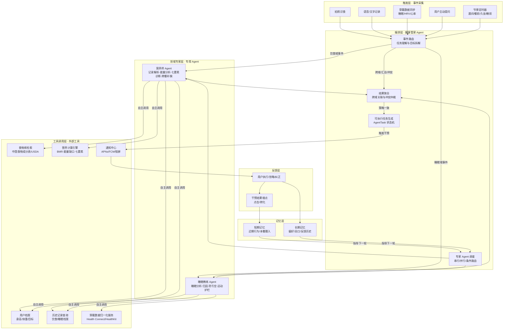
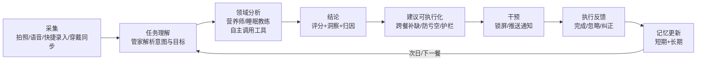
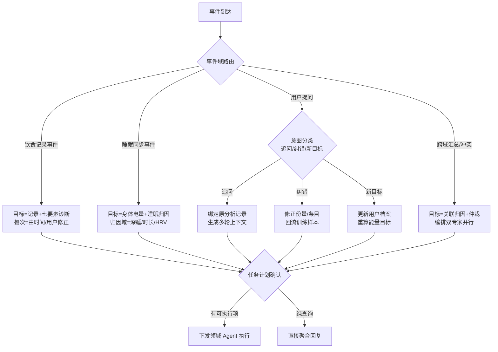
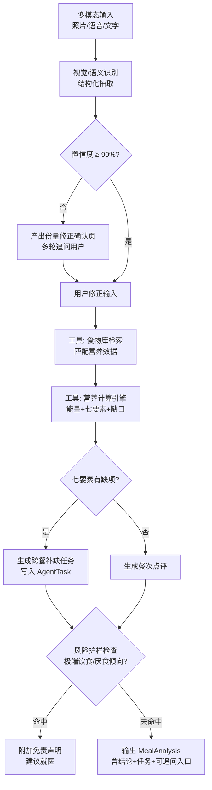
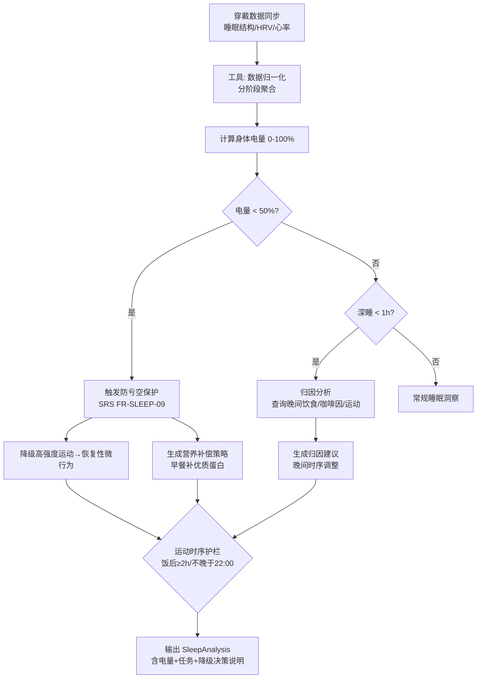
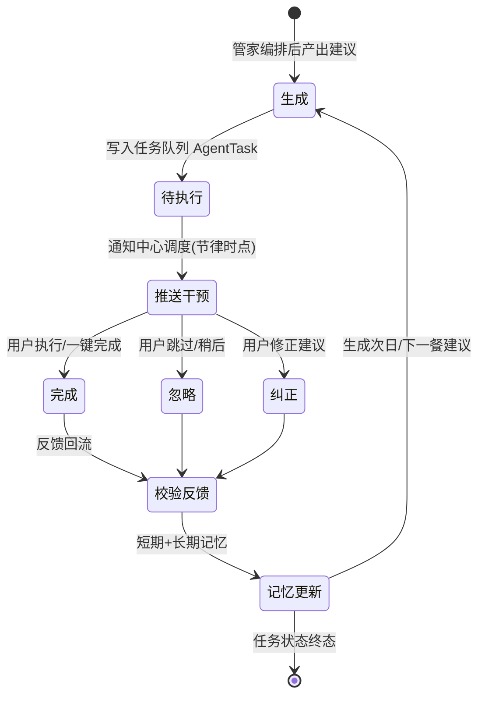
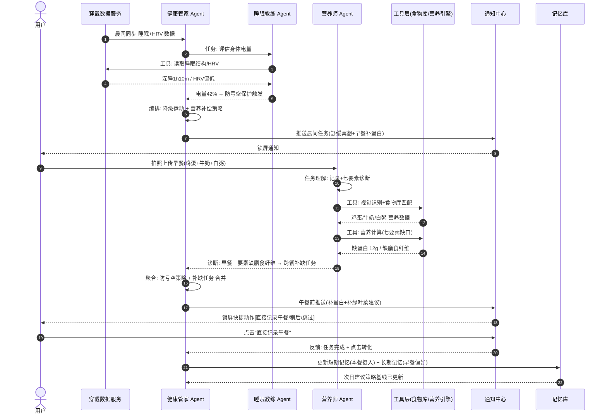

# 多 Agent 工作流编排设计（闭环型 Agent 应用）

> 配套需求：SRS §3 系统架构与闭环机制、§5 AI Agent 需求、§5.3 闭环状态机；《健康伴侣-功能清单》二、四、六
> 设计定位：**无界应用赛道 · 智能体应用**——进入真实健康管理业务场景，解决"记录→分析→干预→反馈"的完整问题
> 编写日期：2026-08-09

---

## 1. 设计结论先行

本方案采用 **"编排者（健康管家） + 领域专家（营养师 / 睡眠教练） + 工具层 + 记忆层 + 反馈层"** 的多 Agent 架构。

**判定自证：是否为 Agent，不看 LLM 调用次数，而看是否形成"任务理解 → 流程编排 → 工具调用 → 多轮交互 → 结果交付"的闭环。** 本方案五项全闭环：

| 闭环要素 | 本方案对应设计 | 证据 |
|---|---|---|
| ① 任务理解 | 事件被解析为"目标 + 餐次 + 归因域"的结构化任务，而非简单接话 | §4.1 任务理解子流程 |
| ② 流程编排 | 健康管家按事件域路由、按依赖关系编排专家 Agent 串行/并行执行 | §3.1 / §5 全局流程图 |
| ③ 工具调用 | 专家 Agent 自主调用食物库、营养计算引擎、穿戴数据、通知中心、记忆库等外部工具 | §3 各模块工具列 |
| ④ 多轮交互 | 份量修正追问、跨餐补缺追问、用户反馈回流驱动下一轮建议 | §7 场景时序 |
| ⑤ 结果交付 | 建议落为可执行任务（AgentTask 状态机）→ 通知干预 → 反馈回流更新记忆 → 影响次日建议 | §6 状态机 |

> 本方案**不是**"同一任务内多段 prompt 串联"的 workflow：每个模块有独立职责、独立决策逻辑、独立工具集，且通过记忆与反馈形成跨轮次的自我迭代，符合"多模块协作 + 持续迭代结果"的 Agent 用法。

---

## 2. 总体架构与模块职责

### 2.1 全局编排流程图



### 2.2 模块职责规格表

> 规格格式：**职责｜输入｜输出｜决策逻辑｜外部工具｜闭环环节**

| 模块 | 职责 | 输入 | 输出 | 决策逻辑 | 外部工具 | 闭环环节 |
|---|---|---|---|---|---|---|
| **健康管家 Agent**（编排者） | 事件路由、任务拆解、专家调度、结果聚合、冲突仲裁、任务生成、通知文案 | 全部触发事件 + 各专家 Agent 输出 + 用户反馈 | 结构化 AgentTask、通知文案、记忆更新指令 | 事件域路由表；跨域冲突仲裁优先级（§5）；降噪规则（同类型 N 次未点击降频） | 通知中心、记忆库 | ①②③⑤：编排全链路 |
| **营养师 Agent**（领域专家） | 多模态记录解析、能量/七要素分析、餐次点评、跨餐补缺、食谱推荐 | 照片/语音/文字 + 用户档案 + 历史记录 | 结构化饮食条目、MealAnalysis、补缺任务建议 | 置信度阈值（<90% 触发份量确认）；七要素缺项 → 跨餐记账；风险护栏（极端饮食→免责+就医） | 食物库检索、营养计算引擎、用户档案、历史记录 | ①③④⑤：理解→工具→多轮确认→结果交付 |
| **睡眠教练 Agent**（领域专家） | 睡眠结构分析、归因、身体电量评估、防亏空保护、运动护栏、睡前干预 | 穿戴数据 + 用户档案 + 历史记录 | SleepAnalysis、身体电量、降级/补偿策略 | 电量 <50% → 触发防亏空保护（§5）；深睡 <1h → 归因查询晚间饮食/咖啡因；运动时序护栏 | 穿戴数据归一化、用户档案、历史记录 | ①③⑤：理解→工具→结果交付 |
| **通知中心**（执行器工具） | 多通道触达（应用内/推送/锁屏）、免打扰、降噪、埋点 | AgentTask + 通知模板 + 投放策略 | 送达/点击/转化埋点数据 | 免打扰时段；按埋点动态降频 | APNs/FCM/锁屏 Rich Notification | ⑤：干预执行 + 结果回收 |
| **记忆库**（记忆层） | 短期记忆（近期行为）+ 长期记忆（偏好/忌口/过敏/反馈），可查看/删除 | 用户反馈、Agent 决策、任务状态 | 记忆快照供专家 Agent 检索 | 短期滚动过期；长期仅用户显式确认写入 | 本地加密存储 + 云端同步 | ④⑤：反馈→记忆→迭代 |

---

## 3. 核心业务闭环（宏观循环）



> **闭环验收原则（沿用 SRS §3.2）**：系统中不存在"孤岛数据"。每一条记录必须有 Agent 处理痕迹，每一条建议必须能追踪到用户反馈或干预结果。

---

## 4. 关键子流程设计

### 4.1 任务理解子流程（健康管家 Agent 内）



### 4.2 营养师 Agent 记录分析子流程



### 4.3 睡眠教练 Agent 防亏空子流程



---

## 5. 冲突仲裁决策逻辑（管家 Agent 内）

> 典型场景：**睡眠不足（睡眠教练）vs 建议运动（营养师）**

```mermaid
flowchart TD
    A[收到双专家冲突输出] --> B{电量 < 50%?<br/>防亏空保护}
    B -->|是| C[硬约束: 高强度运动不可执行<br/>确定性规则, 不交 LLM 决策]
    C --> D[降级为恢复性微行为<br/>泡脚/拉伸/慢走]
    D --> E[合并营养补偿策略<br/>早餐补蛋白抗疲劳]
    E --> F[向用户透明说明决策原因<br/>"前夜睡眠不足, 跑步替换为慢走"]
    B -->|否| G{时序冲突?<br/>运动vs用餐窗口}
    G -->|是| H[按护栏规则校准<br/>饭后≥2h/晚餐≤20:00/运动≤22:00]
    G -->|否| I[正常合并执行<br/>双建议无冲突]
    F --> J[生成 AgentTask<br/>写入状态机]
    H --> J
    I --> J
```

**优先级规则（硬约束，确定性代码实现，LLM 只做表达不决策）：**

| 优先级 | 规则 | 依据 |
|---|---|---|
| P1 | 睡眠/精力安全 > 一切安排（电量 <50% 强制降级） | FR-SLEEP-09 |
| P2 | 运动时序护栏（饭后 ≥2h、晚餐 ≤20:00、运动 ≤22:00） | FR-SLEEP-11 |
| P3 | 能量/营养目标（降级时以营养补偿替代取消） | FR-DIET-14 |
| P4 | 用户偏好与反馈（记忆层数据加权） | FR-AGENT-06 |

---

## 6. 结果交付：AgentTask 闭环状态机



---

## 7. 典型业务场景走查（晨间防亏空 × 早餐闭环）

> 一个真实业务场景串联全部闭环要素，供评审快速理解 Agent 设计。



---

## 8. 与赛道要求对照自证

| 赛道口径 | 本方案回应 |
|---|---|
| 进入真实业务场景、解决具体问题 | 以"晨间防亏空 + 早餐记录 + 跨餐补缺"为落地场景（§7），解决"健康管理最后一步（执行与反馈）"缺失的行业问题（SRS §2.1） |
| 不鼓励单点问答或简单内容生成 | 所有输出均落为可执行 AgentTask 并追踪反馈（§6 状态机）；对话仅是闭环入口之一，不是产品形态本身 |
| Agent = 任务理解/流程编排/工具调用/多轮交互/结果交付闭环 | §1 五项逐条映射；专家 Agent 自主调用 6 类外部工具（§2.2 工具列） |
| 多 Agent 用法需角色分工 + 自主调工具 + 持续迭代结果 | 管家/营养师/睡眠教练三角色职责隔离（§2.2）；记忆层驱动跨轮次迭代（§6 状态机回环） |
| 每模块写清职责/输入/输出/决策逻辑/外部工具/闭环 | §2.2 模块规格表 + §4 子流程 + §5 仲裁逻辑 |

---

## 9. 实现要点与降级策略

| 要点 | 说明 |
|---|---|
| 编排器确定性优先 | 路由、仲裁、降级均为确定性规则代码；LLM 仅负责分析、点评与文案生成，降低幻觉风险 |
| 工具调用接口化 | 6 类工具均为标准接口（REST/查询），专家 Agent 通过 Function Calling 调用，便于评审与测试 |
| 模型分级降本 | 意图分类用小模型，深度分析用大模型；AI 接口按用户/天配额限流（SRS §8.2） |
| 降级路径 | 视觉识别失败 → 多模态 LLM 直读 → 文字/语音手动记录（P0 独立入口）；通知被忽略 N 次 → 降频/转周报（FR-NOTIFY-06） |
| 可观测性 | 每条 AgentTask 记录 生成→推送→反馈 全链路事件；通知埋点用于降噪评估（FR-NTF-07） |
