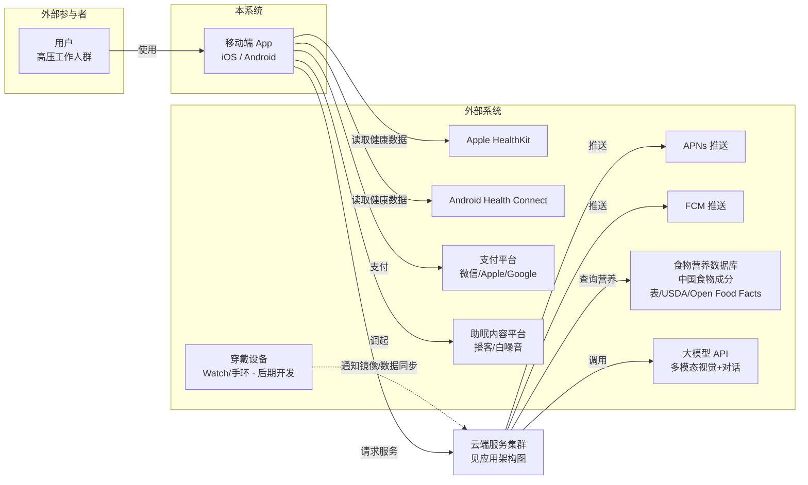
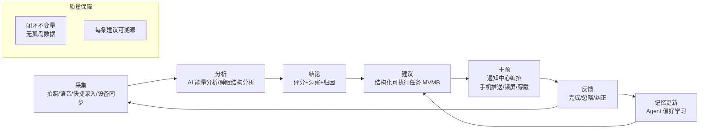
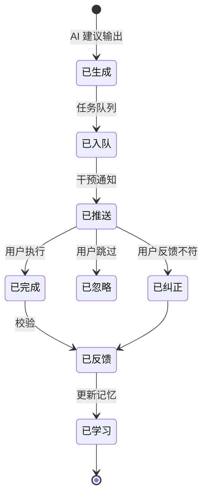
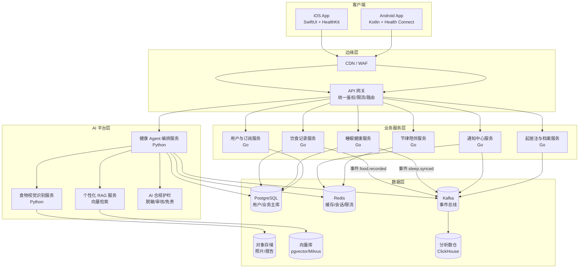
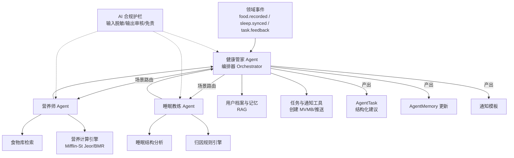
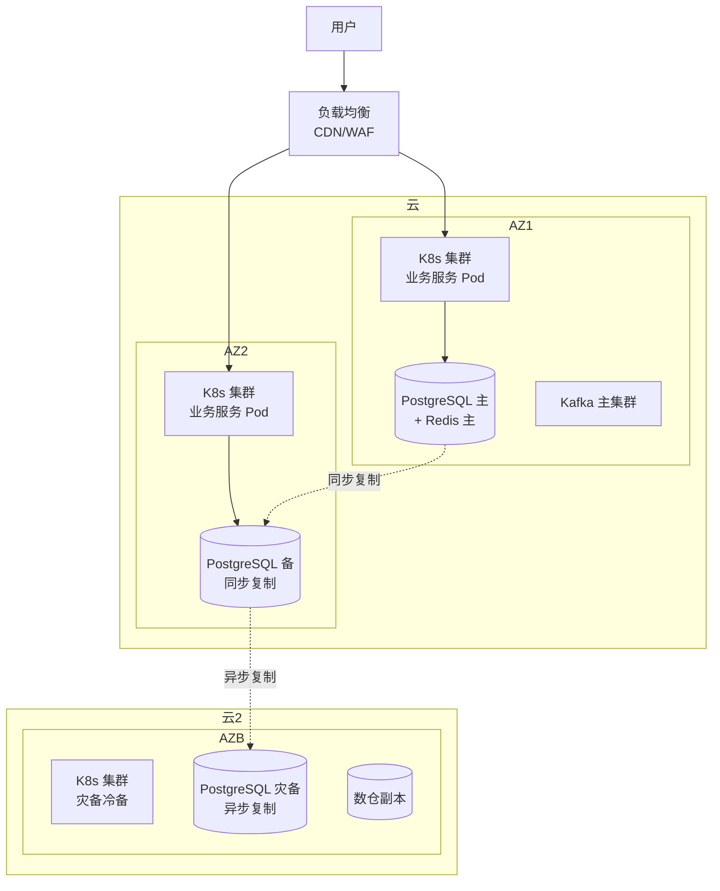
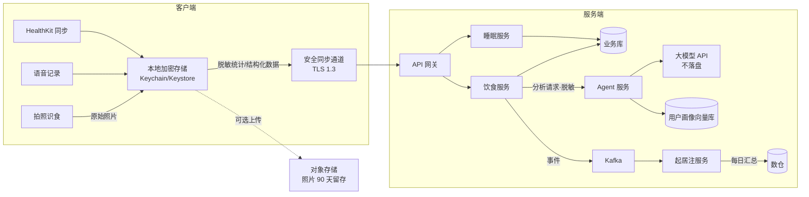
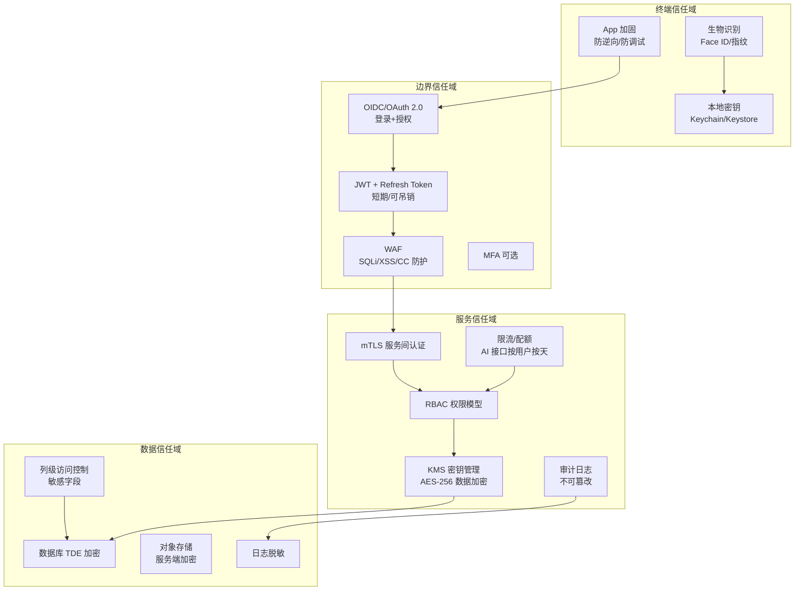
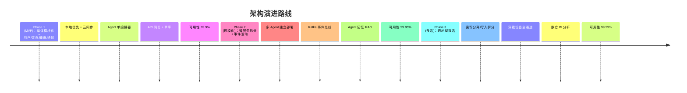

# 系统架构图集

## Architecture Diagram Set

| 项目 | 内容 |
|------|------|
| 文档编号 | ADS-AIH-2026-001 |
| 版本 | V1.0 |
| 关联文档 | 《国际标准架构标准说明书》(ISA-AIH-2026-001)、《技术架构书》(TAD-AIH-2026-001)、SRS V1.1 |

> 本图集使用 Mermaid 语法绘制，在文档中心（MkDocs Material）中可交互渲染。架构版本号与《国际标准架构标准说明书》保持一致。

---

## 1. 系统上下文图 (System Context)

描述本系统与外部参与者及外部系统的边界（C4 模型第 1 层）。

**说明**：
- 穿戴设备通道为后期开发项，以虚线表示预留边界；
- 大模型 API 调用仅存在于服务端，客户端不直接持有模型凭据。

---

## 2. 业务闭环图 (Business Closed-Loop)

系统的核心差异化管理闭环（SRS 3.2 的架构化表达）。

**状态机（建议任务生命周期）**：

---

## 3. 应用架构图 (Application Architecture)

微服务边界、交互机制与 AI 平台（C4 第 2 层）。

**交互机制要点**：
1. **同步链路**（REST/WebSocket）：客户端 ↔ 网关 ↔ 业务服务，Agent 流式输出经 WebSocket；
2. **异步链路**（事件驱动）：业务服务发布领域事件至 Kafka，Agent 订阅后异步分析，分析结果经通知服务回调用户；
3. 跨服务事务采用 **Saga + 事件补偿**，禁止分布式事务强一致（TCC 仅限支付域）；
4. 所有服务经网关对外，内部服务间默认 mTLS（见安全架构图）。

---

## 4. Agent 编排图 (Agent Orchestration)

多 Agent 协作与工具调用（SRS 第 5 章）。

**编排策略**：
- **编排者模式**：健康管家 Agent 作为 orchestrator 完成跨域推理（饮食×睡眠关联，FR-AGENT-09）与任务编排；
- 每个 Agent 为**有界工具使用者**，只能调用职责范围内的工具；
- Agent 输出必须(shall)经结构化校验（JSON Schema）后才可生成任务与通知。

---

## 5. 部署拓扑图 (Deployment Topology)

云原生容器化部署、多可用区高可用（对应 NFR-AVAIL ≥99.9%，目标 99.99%）。

**容灾与高可用设计**（详见技术架构书 §6）：

| 维度 | 设计 | 指标 |
|------|------|------|
| 同城双可用区 | 主备同步复制，自动故障转移 | RPO ≤ 5min，RTO ≤ 1h |
| 跨地域灾备 | 异步复制 + 冷备可拉起 | RPO ≤ 15min（目标） |
| 应用层 | 多副本 + HPA 自动扩缩容 | 滚动发布零停机 |
| 多活演进 | 第一阶段主备，第二阶段两地双活（写入拆分） | 见演进路线 |

---

## 6. 数据流图 (Data Flow Diagram)

核心数据端到端流转（本地优先 + 云端脱敏策略）。

**数据流转规则**：
1. 原始照片与健康明细**默认本地优先**，仅结构化脱敏数据上云（FR-DATA-02）；
2. 大模型输入必须(shall)经脱敏（去身份标识），输出经合规审核，不使用用户数据训练第三方模型；
3. 数据留存：原始照片 90 天，分析结果永久（脱敏）；注销后 30 天内彻底删除（FR-DATA-04）。

---

## 7. 安全架构图 (Security & Compliance Architecture)

零信任模型与纵深防御。

**安全基线**（映射 ISO/IEC 27002 控制项，详见技术架构书 §7）：
- 传输层：全链路 TLS 1.3（RFC 8446）；服务间 mTLS；
- 存储层：数据库 TDE + 敏感字段 AES-256 列级加密；密钥经 KMS 轮换管理；
- 身份：OIDC + JWT 短期令牌（建议 ≤15min）+ Refresh Token 轮换；健康数据接口设备级校验；
- 审计：全量操作审计日志，日志落盘前脱敏；
- 合规：等保二级起步、PIPL 合规处理、生成式 AI 服务备案与内容审核。

---

## 8. 演进路线图 (Architecture Evolution)

---

## 附录 A. 图集索引

| 图号 | 名称 | 对应章节 |
|------|------|----------|
| AD-01 | 系统上下文图 | ISA §5.2 |
| AD-02 | 业务闭环图 / 状态机 | ISA §5.1、SRS §3.2 |
| AD-03 | 应用架构图 | ISA §5.3 |
| AD-04 | Agent 编排图 | ISA §5.3、SRS §5 |
| AD-05 | 部署拓扑图 | ISA §5.4 |
| AD-06 | 数据流图 | ISA §5.2 |
| AD-07 | 安全架构图 | ISA §5.5 |
| AD-08 | 演进路线图 | ISA §7 |
